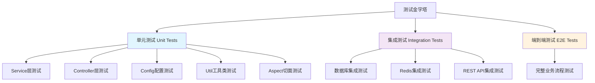
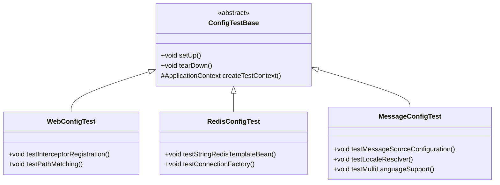

# **单元测试补充设计文档**

## **I. 需求分析**

### A. 目标定义

**核心业务目标：**
- 提高代码测试覆盖率至85%以上
- 确保关键业务逻辑的可靠性和稳定性
- 建立完善的测试体系，支持持续集成和交付
- 降低生产环境缺陷率，提升代码质量

### B. 需求规格说明

#### 1. 功能性需求

**测试覆盖范围：**
- **配置类测试**: 补充缺失的配置类单元测试，验证Bean创建和配置正确性
- **工具类测试**: 补充YamlPropertySourceFactory等工具类测试
- **边界条件测试**: 增强现有测试的边界条件和异常情况覆盖
- **集成测试**: 补充关键业务流程的集成测试
- **性能测试**: 添加关键接口的性能基准测试

**测试质量标准：**
- 每个public方法至少有一个测试用例
- 异常分支覆盖率达到80%以上
- 测试用例遵循AAA模式（Arrange-Act-Assert）
- 使用有意义的测试名称和清晰的断言信息

#### 2. 非功能性需求

**性能要求：**
- 单元测试执行时间不超过5分钟
- 单个测试用例执行时间不超过500ms
- 测试并发执行支持，提高CI/CD效率

**维护性要求：**
- 测试代码可读性强，易于维护
- 使用Mock技术减少外部依赖
- 测试数据隔离，避免测试间相互影响

### C. 验证标准

**测试覆盖率指标：**
- 行覆盖率：≥85%
- 分支覆盖率：≥80%
- 方法覆盖率：≥90%
- 类覆盖率：≥95%

**代码质量指标：**
- SonarQube代码质量评级：A级
- 测试代码与生产代码比例：1:1至1:1.5
- 测试用例通过率：100%

## **II. 架构设计**

### A. 测试架构蓝图

#### 1. 测试层次结构

#### 2. 测试组件分解

**需要补充的核心组件测试：**

- **WebConfig**: Web配置类（拦截器注册）
- **RedisConfig**: Redis配置类（连接和模板配置）
- **RestTemplateConfig**: HTTP客户端配置
- **ValidationConfig**: 参数验证配置
- **YamlPropertySourceFactory**: YAML属性源工厂
- **LocalConfigProperties**: 本地配置属性
- **NacosConfig**: Nacos服务发现配置

### B. 技术选型

**测试框架栈：**
- **JUnit 5**: 主要测试框架（已使用）
- **Mockito**: Mock框架（已使用）
- **Spring Boot Test**: Spring集成测试支持（已使用）
- **TestContainers**: 容器化集成测试（推荐新增）
- **WireMock**: HTTP服务Mock（推荐新增）

**测试工具：**
- **JaCoCo**: 代码覆盖率工具
- **SonarQube**: 代码质量分析
- **Maven Surefire**: 测试执行插件

### C. 组件和接口设计

#### 1. 配置类测试设计

#### 2. 工具类测试设计

**YamlPropertySourceFactory测试用例：**
- 正常YAML文件加载测试
- 无效YAML文件异常处理测试
- 编码处理测试
- 属性解析准确性测试

### D. 数据模型

**测试数据管理策略：**
- 使用@TestConfiguration创建测试专用配置
- 使用@MockBean替换外部依赖
- 使用@TestPropertySource覆盖配置属性
- 建立测试数据工厂模式统一管理测试数据

### E. 错误处理

**测试异常场景覆盖：**
- 配置加载失败场景
- 外部服务不可用场景
- 参数验证失败场景
- 数据库连接异常场景
- Redis连接异常场景

### F. 本地化测试

**多语言环境测试：**
- 中文环境消息正确性测试
- 英文环境消息正确性测试
- 语言切换功能测试
- 默认语言回退机制测试

## **III. 实施计划**

### 阶段一：配置类测试补充（优先级：高）

**目标组件：**
1. WebConfig - Web配置测试
2. RedisConfig - Redis配置测试
3. RestTemplateConfig - REST客户端配置测试
4. ValidationConfig - 验证器配置测试
5. NacosConfig - 服务发现配置测试
6. LocalConfigProperties - 本地配置测试

**预期产出：**
- 6个新的配置类测试文件
- 配置加载和Bean创建的完整测试覆盖
- 配置异常场景的测试用例

### 阶段二：工具类和边界条件测试（优先级：高）

**目标组件：**
1. YamlPropertySourceFactory - YAML加载工具测试
2. 现有Service层边界条件补充
3. Controller层异常处理增强
4. DTO验证规则完整性测试

**预期产出：**
- 工具类100%方法覆盖
- 边界条件测试用例增加50%
- 异常分支覆盖率提升至80%

### 阶段三：集成测试和性能测试（优先级：中）

**目标场景：**
1. 数据库操作集成测试
2. Redis缓存集成测试
3. 完整认证流程集成测试
4. 关键接口性能基准测试

**预期产出：**
- 5个集成测试类
- 性能基准测试套件
- CI/CD流水线集成

## **IV. 成功指标**

### 量化指标

**测试覆盖率目标：**
- 整体代码覆盖率：从当前约70%提升至85%+
- 配置类覆盖率：从20%提升至95%+
- 工具类覆盖率：从40%提升至100%
- Service层覆盖率：从85%提升至95%+

**质量指标：**
- 新增测试用例数量：60+个
- 测试执行时间：≤5分钟
- 测试稳定性：通过率99.5%+
- 代码质量评级：SonarQube A级

### 质量保证

**测试代码标准：**
- 遵循Given-When-Then模式
- 测试方法命名遵循`should_ExpectedBehavior_When_StateUnderTest`模式
- 每个测试类包含JavaDoc说明
- Mock使用适度，避免过度Mock导致测试价值降低

## **V. 风险管控**

### 技术风险

- **配置复杂性风险**: 某些配置类依赖复杂，可能难以独立测试
  - *缓解措施*: 使用@TestConfiguration创建简化的测试配置

- **外部依赖风险**: Redis、数据库等外部依赖可能影响测试稳定性
  - *缓解措施*: 使用TestContainers或内存数据库进行隔离测试

### 时间风险

- **测试编写工作量**: 可能超出预期时间
  - *缓解措施*: 优先级排序，分阶段实施

- **CI/CD集成时间**: 新增测试可能延长构建时间
  - *缓解措施*: 并行测试执行，优化测试性能

## **VI. 验收标准**

### 完成标准

✅ **必须满足的条件：**
- [ ] 所有配置类都有对应的测试类
- [ ] 整体代码覆盖率达到85%以上
- [ ] 所有新增测试用例通过
- [ ] 测试执行时间在5分钟以内
- [ ] 无SonarQube主要质量问题

🎯 **理想达成的目标：**
- [ ] 代码覆盖率达到90%以上
- [ ] 建立性能基准测试套件
- [ ] 集成测试覆盖核心业务流程
- [ ] 测试文档完整，易于维护

---

*本设计文档将指导单元测试补充工作的实施，确保在不编写实际代码的前提下，为开发团队提供清晰的测试策略和实施路径。*