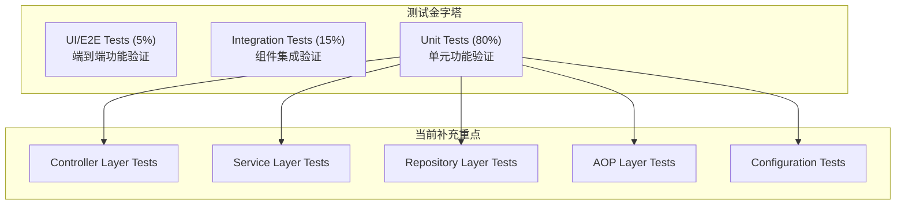
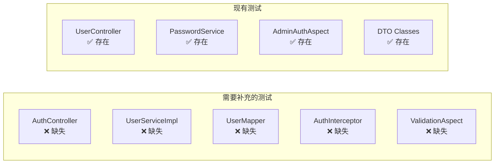
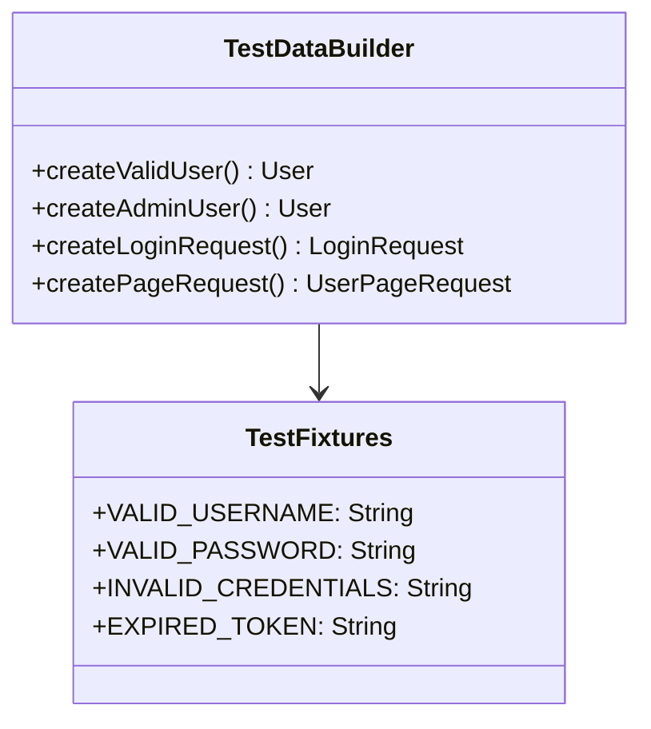
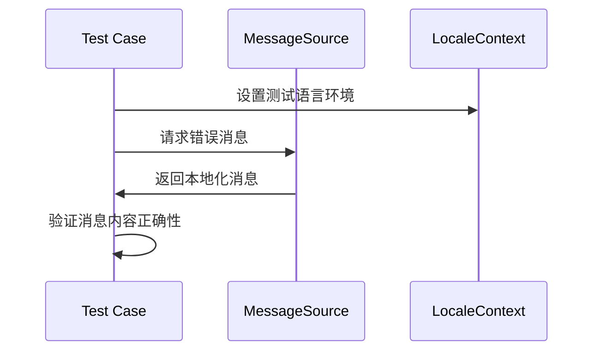

# **单元测试覆盖率提升功能设计文档**

## **I. Requirements Analysis**

### **A. Goal Definition**
1. **核心业务目标**：提升代码质量和系统可靠性
   - 将单元测试覆盖率从当前的约40%提升至80%以上
   - 确保关键业务逻辑和边界条件得到充分测试
   - 建立持续集成中的测试质量门禁机制

### **B. Requirement Specification**

#### **1. Functional Requirements:**

**FR-1: 核心业务组件测试覆盖**
*"作为开发人员，我需要为所有核心业务组件编写全面的单元测试，以确保业务逻辑的正确性和稳定性。"*

- **AuthController**: 登录接口的各种场景测试
- **UserServiceImpl**: 用户服务核心逻辑测试  
- **UserMapper**: 数据访问层集成测试
- **AuthInterceptor**: 权限拦截器功能测试
- **ValidationAspect**: 参数校验切面测试

**FR-2: 边界条件和异常场景测试**
*"作为QA工程师，我需要确保系统在各种异常和边界条件下的行为符合预期，以提升系统健壮性。"*

- 无效输入参数处理
- 网络异常和超时场景
- 缓存失效和数据库连接异常
- 并发访问和资源竞争

**FR-3: 集成点测试覆盖**
*"作为系统架构师，我需要验证各个组件间的集成点工作正常，以确保系统整体功能完整性。"*

- Redis缓存操作测试
- 外部服务调用模拟测试
- 数据库事务处理测试
- 消息源国际化测试

#### **2. Non-functional Requirements:**

- **测试执行性能**: 单元测试套件执行时间应 <30秒
- **测试覆盖率**: 行覆盖率 ≥80%，分支覆盖率 ≥75%
- **测试维护性**: 测试代码应具备良好的可读性和可维护性
- **CI/CD集成**: 支持持续集成环境中的自动化测试执行

### **C. Validation**

⚠️ **需要澄清的模糊需求**:
- 是否需要为所有配置类编写测试？
- 测试数据管理策略（内存数据库 vs 测试专用环境）
- 性能测试和压力测试的边界定义

## **II. Architecture Design**

### **A. Structural Blueprint**

#### **1. 测试层次架构**



#### **2. 测试组件分解**

• **Controller Tests**: 负责验证HTTP接口的请求响应处理逻辑
• **Service Tests**: 负责验证业务逻辑的正确性和异常处理
• **Repository Tests**: 负责验证数据访问层的查询和持久化操作
• **AOP Tests**: 负责验证横切关注点（权限、校验）的切面逻辑
• **Configuration Tests**: 负责验证配置类的条件加载和Bean创建

### **B. Technology Selection**

- **测试框架**: 选择JUnit 5 - 提供现代化的测试编写体验和丰富的断言API
- **模拟框架**: 选择Mockito - 成熟的Java模拟框架，与Spring Boot深度集成
- **测试切片**: 选择Spring Boot Test Slices - 提供轻量级的上下文加载，提升测试执行速度
- **内存数据库**: 选择H2 - 快速的内存数据库，适合单元测试场景
- **测试覆盖率**: 选择JaCoCo - 业界标准的Java代码覆盖率工具

### **C. Components and Interfaces Design**

#### **1. 缺失测试组件清单**



#### **2. 测试架构设计**

**AuthController 测试设计**:
```java
@WebMvcTest(AuthController.class)
class AuthControllerTest {
    // 测试登录成功场景
    // 测试登录失败场景
    // 测试系统异常处理
    // 测试请求参数校验
}
```

**UserServiceImpl 测试设计**:
```java
@ExtendWith(MockitoExtension.class)
class UserServiceImplTest {
    // 测试管理员登录逻辑
    // 测试普通用户登录逻辑
    // 测试Token生成和缓存
    // 测试分页查询逻辑
    // 测试异常场景处理
}
```

**UserMapper 测试设计**:
```java
@MybatisTest
class UserMapperTest {
    // 测试用户查询操作
    // 测试用户插入操作
    // 测试用户更新操作
    // 测试分页查询操作
}
```

### **D. Data Models**

#### **测试数据管理策略**



### **E. Error Handling**

#### **异常测试覆盖策略**

1. **业务异常测试**:
   - `IllegalArgumentException`: 无效参数异常
   - `AuthenticationException`: 认证失败异常
   - `AccessDeniedException`: 权限拒绝异常

2. **系统异常测试**:
   - `DataAccessException`: 数据库访问异常
   - `RedisConnectionException`: Redis连接异常
   - `RestClientException`: 外部服务调用异常

3. **测试异常处理模式**:
```java
@Test
void whenDatabaseError_thenThrowException() {
    // Given
    when(userMapper.findByUsername(any()))
        .thenThrow(new DataAccessException("Database error") {});
    
    // When & Then
    assertThrows(DataAccessException.class, 
        () -> userService.login(validRequest));
}
```

### **F. Localization Testing**

#### **国际化消息测试策略**



**测试用例示例**:
```java
@ParameterizedTest
@ValueSource(strings = {"zh_CN", "en_US"})
void testErrorMessages(String localeCode) {
    // 测试不同语言环境下的错误消息
}
```

## **III. Implementation Strategy**

### **A. 测试实施优先级**

**Phase 1: 核心业务逻辑测试 (Week 1-2)**
1. AuthController 完整测试套件
2. UserServiceImpl 核心业务逻辑测试
3. UserMapper 数据访问测试

**Phase 2: 横切关注点测试 (Week 3)**
1. AuthInterceptor 权限拦截测试
2. ValidationAspect 参数校验测试
3. 异常处理和边界条件测试

**Phase 3: 配置和集成测试 (Week 4)**
1. 缺失的配置类测试补充
2. 集成点测试加强
3. 测试覆盖率验证和优化

### **B. 质量门禁设置**

- **最低覆盖率要求**: 80% 行覆盖率
- **关键路径覆盖**: 100% 关键业务路径覆盖
- **测试执行时间**: 单次完整测试 <30秒

### **C. 持续集成集成**

```yaml
# CI Pipeline Test Stage
test:
  stage: test
  script:
    - mvn test
    - mvn jacoco:report
  coverage: '/Total.*?([0-9]{1,3})%/'
  artifacts:
    reports:
      junit: target/surefire-reports/TEST-*.xml
      coverage_report:
        coverage_format: cobertura
        path: target/site/jacoco/jacoco.xml
```

## **IV. Success Metrics**

### **量化指标**
- **代码覆盖率**: 从40% → 80%+
- **测试用例数量**: 从30+ → 100+
- **缺陷发现率**: 提升50%（通过测试前移）
- **CI/CD管道稳定性**: 95%+ 成功率

### **质量指标**  
- **测试可维护性**: 代码重复率 <5%
- **测试执行效率**: 平均执行时间 <30秒
- **业务逻辑覆盖**: 关键业务场景 100%覆盖